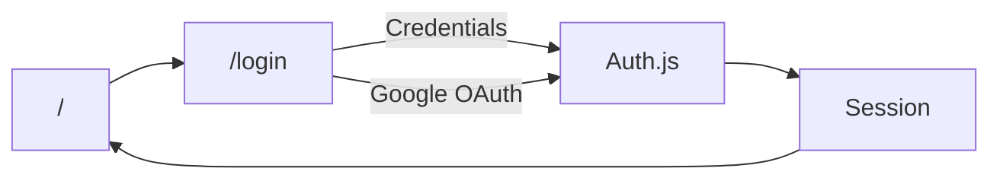

# ログイン機能 実装計画

メール／パスワードと Google SSO を **1つのログインページ** にまとめ、見た目 → Auth.js → Zod バリデーション → テストの順で実装する。ユーザー保存は学習用モックから始め、スタイルは既存の Tailwind に合わせる。

## 前提（確定）

- **ページ**: ログインは `/login` の1ページで完結（メール＆パスワード ＋ Google SSO）
- **SSO**: Google OAuth（後から他プロバイダー追加しやすい形にする）
- **ユーザー保存**: 固定モックユーザー（メモリ）。DB・Prisma は後回し
- **スタイル**: 既存の **Tailwind CSS v4** を使う。
- **認証の正**: Auth.js（`next-auth` v5）のセッションのみ

## ルート構成

| パス                      | 役割                                                                                         |
| ------------------------- | -------------------------------------------------------------------------------------------- |
| `/`                       | 未ログインなら「ログインしてください」で `/login` へ誘導。ログイン済みなら簡易ダッシュボード |
| `/login`                  | メール＆パスワードフォーム ＋ Google SSO ボタン                                              |
| `/api/auth/[...nextauth]` | Auth.js の API ルート                                                                        |



```
src/
  app/
    layout.tsx
    page.tsx
    login/page.tsx
    api/auth/[...nextauth]/route.ts
  components/auth/
    LoginForm.tsx          # email / password / submit
    GoogleSignInButton.tsx # Google ボタンのみ
  lib/
    auth.ts                # NextAuth 設定（providers / callbacks）
    mock-users.ts          # 固定ユーザー + ハッシュ照合
  schemas/
    login.ts               # Zod スキーマ（client / server 共有）
```

## フェーズ

### Phase 1: 見た目だけのフォーム（機能なし）

1. `/login`: メール・パスワード・送信ボタン（未接続で OK）と「Google でログイン」ボタンを同一ページに配置
2. 区切り（例: 「または」）でフォームと SSO を視覚的に分ける
3. `/` は未ログイン向けに「ログインしてください」と `/login` への誘導を表示（認証分岐は Phase 2）
4. Tailwind でモバイルでも崩れない最小 UI

**確認**: `npm run dev` で `/` から `/login` へ誘導でき、`/login` に両ログイン手段が表示されること

### Phase 2: Auth.js によるログイン

1. 依存関係: `next-auth`（Auth.js v5）、`bcryptjs`（＋型）
2. [src/lib/mock-users.ts](src/lib/mock-users.ts): 固定1ユーザー（例: `demo@example.com`）。パスワードはハッシュのみ保持。平文・ログ出力禁止
3. [src/lib/auth.ts](src/lib/auth.ts):
   - `Credentials`（メール／パスワード）
   - `Google` provider（後から GitHub 等を配列に足せる形）
4. Route Handler: `src/app/api/auth/[...nextauth]/route.ts`
5. `.env.local`（gitignore 済み想定）: `AUTH_SECRET` / `AUTH_GOOGLE_ID` / `AUTH_GOOGLE_SECRET`
6. `/login` 上で Credentials の `signIn` と `signIn("google")` の両方を接続
7. `/` はセッションで分岐: 未ログインなら「ログインしてください」で `/login` へ誘導、ログイン済みなら簡易ダッシュボード（メール表示・ログアウト）
8. `middleware` で必要最小限の保護（`/`・`/login`・Auth API は公開。将来の保護ページ用に基盤を置く）

**確認**: モックユーザーでログイン成功／失敗、Google は環境変数設定後にリダイレクトまで確認。未ログインの `/` で誘導文言が出ること

### Phase 3: Zod バリデーション

1. [src/schemas/login.ts](src/schemas/login.ts): email / password の共通スキーマ
2. クライアント: メール／パスワード送信前に Zod で検証し、フィールドエラー表示
3. サーバー: Credentials の `authorize`（または Server Action）でも同じスキーマを使い、二重の正とする

**確認**: 空・不正メール・短いパスワードでクライアント／サーバー両方で弾かれること

### Phase 4: テスト

1. **Vitest** を導入（ユニット中心）
2. Zod スキーマの成功／失敗ケース
3. `mock-users` のパスワード照合（正しい／誤り）
4. （余裕があれば）`LoginForm` のエラー表示を Testing Library で確認
5. `package.json` に `test` スクリプト追加、README に追記

## セキュリティ（全フェーズ共通）

- パスワード平文をコード・ログに出さない
- 秘密情報は `.env.local` のみ（コミット禁止）
- 認証失敗メッセージは曖昧に（例: 「メールまたはパスワードが正しくありません」）
- Auth.js の CSRF / リダイレクト推奨に従う

## ドキュメント更新タイミング

- Phase 1 完了時: ページ構成を README に追記
- Phase 2 完了時: 環境変数の用意方（値は書かない）
- Phase 4 完了時: `npm test` をスクリプト表に追加
